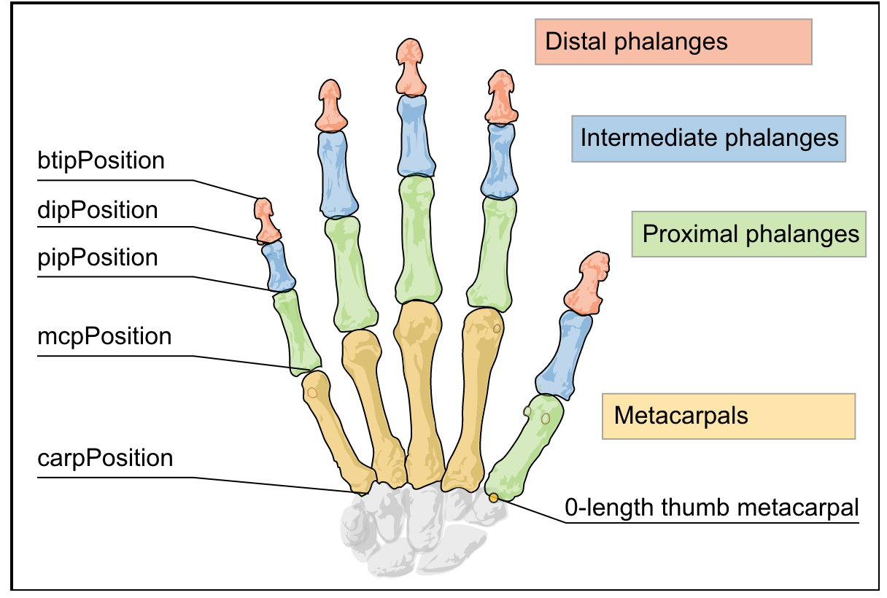

# LeapmotionHandRecognize

->python と leapmotion の合体モジュール

## データの学習

`$ python3 leap_learn.py`

## Leapmotion 起動(csv の生成)

`$ python leapmotion_pd.py`

https://developer-archive.leapmotion.com/documentation/python/devguide/Project_Setup.html
公式ドキュメントの LeapPython.so の項は要注意

